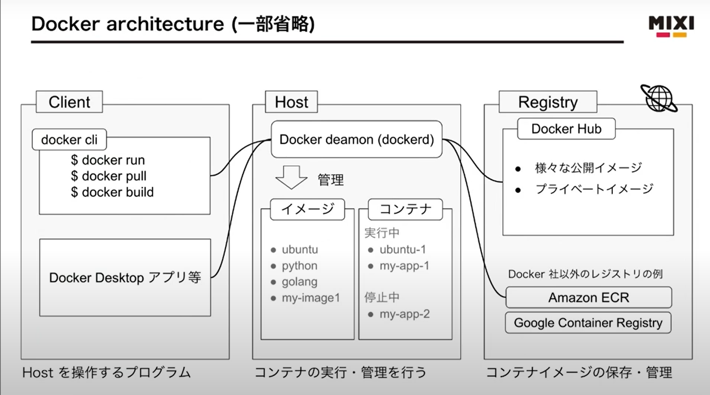
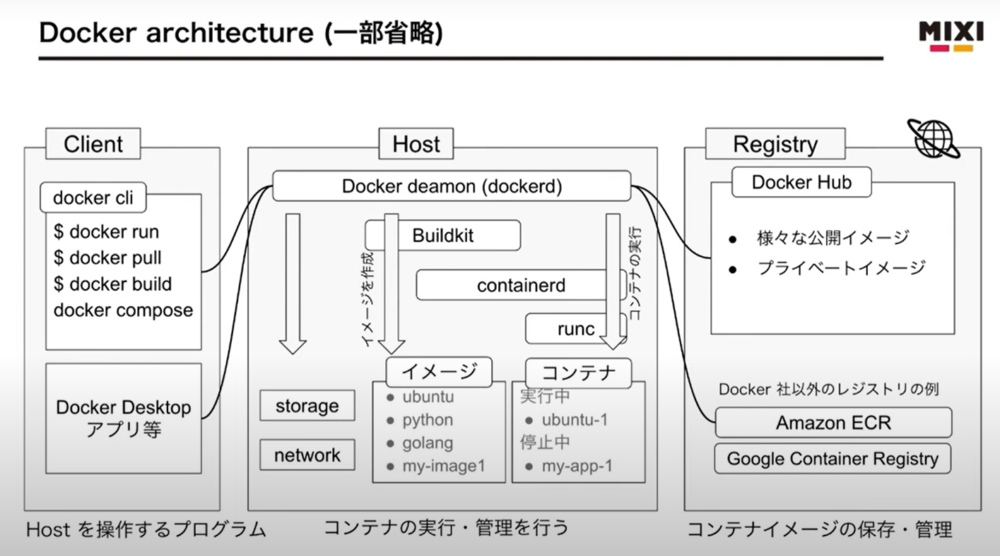

# コンテナ技術
## コンテナの概要
- **コンテナ**：アプリケーションとその依存関係を1つのパッケージにまとめて独立して実行できる環境
### コンテナのメリット
- 複数環境で同じコンテナを動作させることができるので移植性が高い
- VMに比べて軽量でインフラリソースを効率的に利用できる
### 代表的なコンテナ技術
- Docker
- Kubernetes
- AWS ECSなど
### **Docker**
- コンテナ型の仮想環境を作成・配布・実行するためのもの
    - 仮想環境:疑似コンピュータ
        - 物理的なコンピュータのOS:ホストOS, 疑似的コンピュータのOS:ゲストOS
    - コンテナ型:ホストOSを動かしているカーネルを利用してあたかもゲストOSがあるように仮想環境を作りあげること
##### Dockerのメリット
- 複数環境で同じコンテナを動作させることができるので移植性が高い
- OS指定・ミドルウェアのインストール環境設定がコード化されているので、再利用・バージョン管理・配布が容易
- クラウド上に自動でサーバ構築
    - aws, GCP
- Docker HUbで公開されているコンテナイメージを使うことができる


### VMとコンテナ違い
- OSレベル(コンテナ)とハードウェアレベル(VM)
### Dockerコンテナイメージとコンテナランタイム
- コンテナイメージ
    - メタデータ
    - ファイルシステム
**↓**
- コンテナ
    - プロセス
    - ファイルシステム
- **コンテナランタイム**
    - コンテナイメージからコンテナを作成・実行
    - コンテナを起動・終了を管理
    - コンテナの隔離に責任
### コンテナの概要


- docker cli
- Docker deamon(dockerd)
    - イメージとコンテナを管理する

- Docker Hub

#### containerd：Docker内部で利用
- container imageのpull push コンテナの実行と監視
docker cli--(HTTP)-→Docker daemon(dockerd)--(gRPC)-→
containerd→→runc→→コンテナ

#### runc：OCI(Open Container Initiative)によるリファレンス実装



## dockerコマンド(docker操作)
- Windowsの場合は、Windows Power Shellで実行
- ユーザーをdocker userグループに追加する必要がある

##### dockerのversion確認
```docker
//dockerのversionを確認
docker --version
```
#### Docker Hubからイメージを取得
- **docker pull**：Docker Hub上にあるコンテナイメージをローカルにダウンロード
- ※docker pullコマンドはどのディレクトリにいて実行しても問題ない。
```docker
//ex) MySQLのイメージを取得
docker pull mysql
```

#### 取得しているDockerイメージを確認
- PC(ローカル)のコンテナイメージ情報を表示
```docker
docker images
```
#### コンテナを作成して起動
- Docker Hubに記載がある。
```docker
docker run --name (コンテナの識別子) -p (ローカルPCの特定ポート通信:コンテナの特定ポート転送) -e (環境変数の設定) -d (デタッチモードで実行する) イメージ名:version
//環境変数：ローカルの環境変数ではなく、コンテナの環境変数
//-p ポートフォアリング：でポート通信を転送している
//デタッチモード→バックグラウンドで実行

//出力：コンテナID
```
#### コンテナの表示
```docker
docker ps
//-a：停止中のコンテナも表示される。
//オプションなし：現在起動中のコンテナのみ表示
```

#### コンテナ内に入る
```docker
docker exec -it
// -it:コンテナ側でのコマンド操作を今のコンソールから操作可能となる
```

##### コンテナの停止
```docker
docker stop コンテナ名
```

#### コンテナの起動
- **docker run**：新規作成＆起動するためのコマンド
- **docker start**：構築済みのコンテナの起動するためのコマンド
```docker
docker start コンテナ名
```

#### コンテナの削除
```docker
docker rm コンテナ名
```

#### コンテナイメージの削除
```docker
docker rmi イメージ名:version
```

### dockerfileからコンテナイメージを作成する
